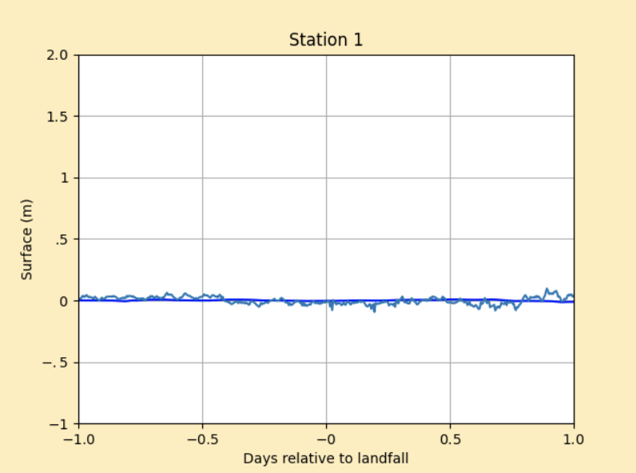
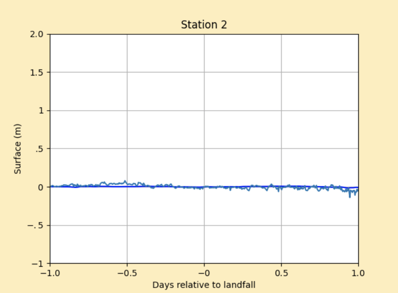
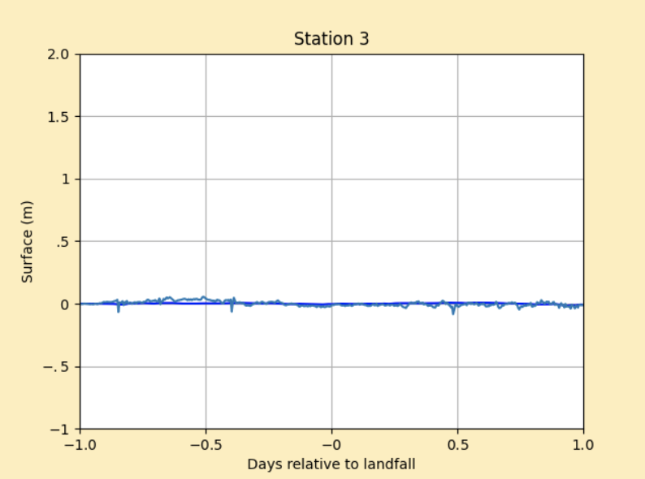

# Storm Report: Hurricane Grace `AL072021`
This folder contains two python files (setrun.py, setplot.py) and one Makefile to simulate storm bevavior of hurricane Grace in August 2021.

## Table of contents
- [Hurricane Grace Information](#hurricane-grace-information)
  * [Path & Landfall](#path--landfall)
  * [Storm surge](#storm-surge)
  * [Rainfall & Flooding](#rainfall--flooding)
- [General Code Execution Guide](#general-code-execution-guide)
- [Topography & Bathymetry Data](#topography--bathymetry-data)
- [Storm Data](#storm-data)
- [GeoClaw Parameters](#geoclaw-parameters)
  * [Landfall & Time Range](#landfall--time-range)
  * [Guages](#guages)
  * [AMRClaw](#amrclaw)
- [Observed Surge Data](#observed-surge-data)
- [Validation Result](#validation-result)
  * [Station 1-Aransas Pass, TX](#station-1-aransas-pass-tx)
  * [Station 2-SPI Brazos Santiago, TX](#station-2-spi-brazos-santiago-tx)
  * [Station 3-South Padre Island CG Station, TX](#station-3-south-padre-island-cg-station-tx)
  * [Result Interpretation](#result-interpretation)
- [Conclusion](#conclusion)

## Hurricane Grace Information

### Path & Landfall
Grace hit the mainland coast of Mexico as a category 3 hurricane. It was the strongest hurricane on record to make landfall in the state of Veracruz. Grace also hit the Yucatan Peninsula of Mexico as a category 1 hurricane and made landfall as a tropical storm in the Dominican Republic and Jamaica. The center of Grace passed just offshore of Tiburon Peninsula on 17 August and moved westward toward Jamaica. Grace made landfall as a category 1 hurricane along the east coast of the Yucatan Peninsula just south of Tulum, Mexico around 0945 UTC 19 August.


### Storm surge
Grace is estimated to raise water levels along the coast of the Yucatan Peninsula of Mexico by as much as 3 to 5 ft above normal tide levels near Tulum. Grace produced negligible water level rises in Puerto Rico and the U.S. Virgin Islands when it passed to the south as a tropical depression. The highest storm surge measured by a National Ocean Service (NOS) tide gauge was 0.64 ft above normal tide levels at Mayaguez, Puerto Rico.


### Rainfall & Flooding
Grace produced 1 to 3 inches of rainfall across portions of Puerto Rico and the U.S. Virgin Islands, but no significant flooding impacts were reported. In Haiti, 12.95 inches of rain was measured in Savane Zombie and 7.26 inches was reported in Fonds-des-Negres. The heavy rainfall and resulting flooding compounded the suffering of tens of thousands of residents who were left homeless following a devastating 7.2-magnitude earthquake on 14 August. In Jamaica, Grace produced 5 to 10 inches of rainfall over portions of the island, with a maximum of 14.07 inches measured in Bois Content. No significant flooding impacts were reported in Cuba.


*Reference: National Hurricane Center Tropical Cyclone Report*
(https://www.nhc.noaa.gov/data/tcr/AL072021_Grace.pdf)

## General Code Execution Guide
If running this example, download setrun.py, setplot.py, and Makefile to the appropriate directory. Execute `$ make all` or `$ make .plots` to compile the code, run the simulation, and plot the results. If problems will be encountered, please refer to <a href="http://www.clawpack.org/quick_surge.html" target="_blank">Storm Surge Guide</a> for possible solutions. 

## Topography & Bathymetry Data
Topography data can be obtained from:
https://www.gebco.net/data_and_products/gridded_bathymetry_data/

Topography file used for this example is stored in professor Kyle Mandli's website and can be fetched in setrun.py by modifying codes in topography section similar to this:
```python
# Fetch topo data
clawutil.data.get_remote_file(
           "http://www.columbia.edu/~ktm2132/bathy/gulf_caribbean.tt3.tar.bz2")
```

## Storm Data
Storm specific data for Hurricane Grace was retrieved from NOAA’s storm data archive:
http://ftp.nhc.noaa.gov/atcf/archive/2021/bal072021.dat.gz

In setrun.py, data can be directly fetched by modifying codes in storm data section similar to this:
```python
# Convert ATCF data to GeoClaw format
clawutil.data.get_remote_file(“http://ftp.nhc.noaa.gov/atcf/archive/2021/bal072021.dat.gz”)
atcf_path = os.path.join(data_dir, “bal072021.dat”)
```

## GeoClaw Parameters
### Landfall & Time Range
Due to limited range of storm specification data, time of ''landfall'' was set in the simulation to be 20 August, 1000 UTC, so that the storm will be simulated when it passes the Gulf of Mexico region. Time range of simulation was set to be 1 days (24 hours) before landfall and 1 day (24 hours) after landfall.
### Gauges
Gauges were selected in the NOAA Inundations dashboard:
https://tidesandcurrents.noaa.gov/map/index.html
### AMRClaw
AMRClaw is a very powerful algorithm to refine areas for analysis. After merging the algorithm in setrun.py, we will be able to have a high resolution of regions which will effectively solve bad simulation curves by GeoClaw due to wrongly appeared dry cells from low resolution. One can include or exclude AMRClaw algorithm by modifying codes in setrun.py similar to
```python
from clawpack.clawutil import clawdata
rundata = clawdata.ClawRunData(claw_pkg, num_dim)
```
One may also want to modify AMR parameters like `amr_levels_max` and `refinement_ratios` in a more customized way. In this example, `amr_levels_max` was set to be `4` and `refinement_ratios` was set to be `[2, 2, 3, 4]`. More information regarding refinement parameter can be found in the documentation here: <a href="https://www.clawpack.org/setrun_amrclaw.html#setrun-amrclaw" target="_blank">AMRClaw Information</a>.

## Observed Surge Data
To compare simulation surge data by GeoClaw, we introduced the observed surge data using `clawpack.geoclaw.util.fetch_noaa_tide_data` along with each gauge's station ID. When plotting the observed surge data, we explicitly deduct the tide amount from sea level at each location to make the data solely representing storm surge. Also, given the recognizable initial differences between observed data and simulation data at all gauges, the mean of water level at each gauge was subtracted from the observed data.

## Validation Result
### Station 1-Aransas Pass, TX
Aransas Pass, TX `ID: 8775241` experienced a storm surge of approximately 0.00 meter. GeoClaw predicted approximately 0.00 meters. 



### Station 2-SPI Brazos Santiago, TX
SPI Brazos Santiago, TX `ID: 8779749` experienced a storm surge of approximately 0.00 meter. GeoClaw predicted approximately 0.00 meters. 



### Station 3-South Padre Island CG Station, TX
South Padre Island CG Station, TX `ID: 8779748` experienced a storm surge of approximately 0.00 meter. GeoClaw predicted approximately 0.00 meters. 




### Result Interpretation
All added gauges observed zero surge and simulated zero surge. The reason for that is because hurricane Grace made a landfall in Veracruz, Mexico where it's still far too south to the southernmost stations in the United States, for example, SPI Brazos Santiago or South Padre Island CG Station in Texas. Therefore, those stations detected no significant water level rise which matched the result from GeoClaw's simulation. 

## Conclusion
This is a special example because all gauges reported nothing very significant. However, it is also a valuable example becauase we can not only conclude storm surge simulation by GeoClaw is solid for stations far from hurricane path, but also infer that category 3 or weaker hurricanes like Grace which came from south east hit mainland coast of Mexico at Veracruz or to the south of it, will unlikely to create a evident storm surge for gaues in Texas, excluding the effect of rainfall. Given the considerable amount of hurricanes that pass the Gulf of Mexico region, future studies may investigate the method that can fetch and plot data from sources like iCyclone or Mexico local stations. 


Author: Jinpai (Max) Zhao
```
jz3445@columbia.edu
```
