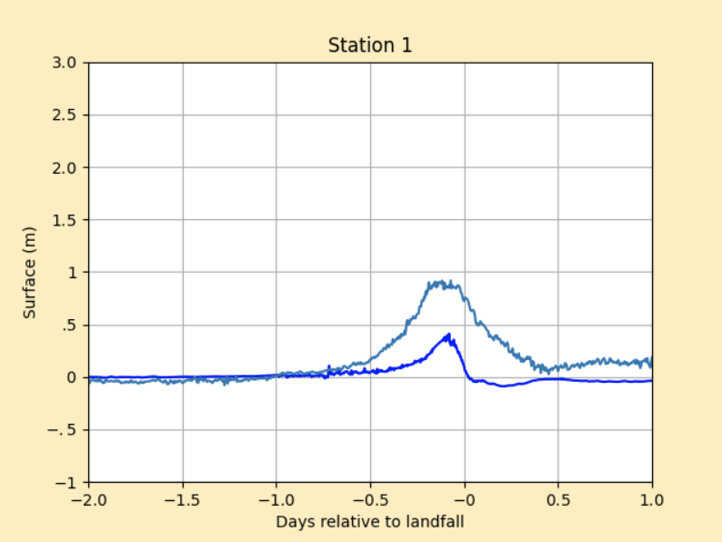
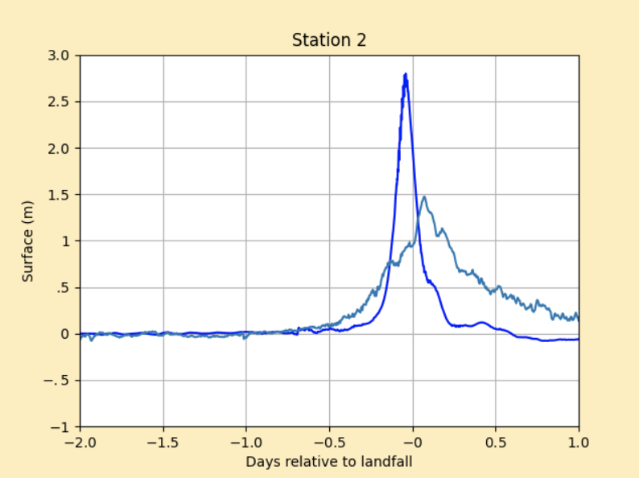
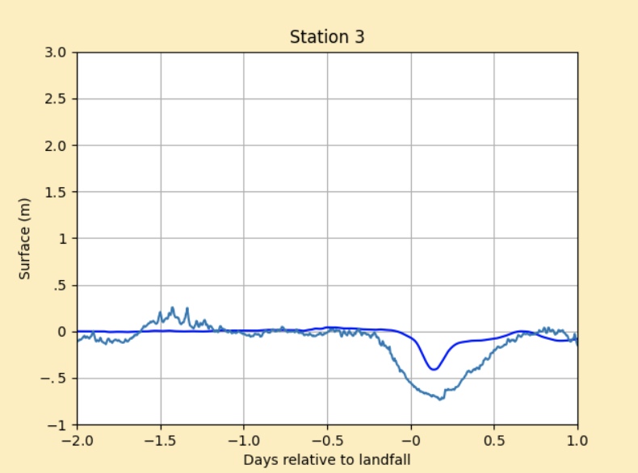
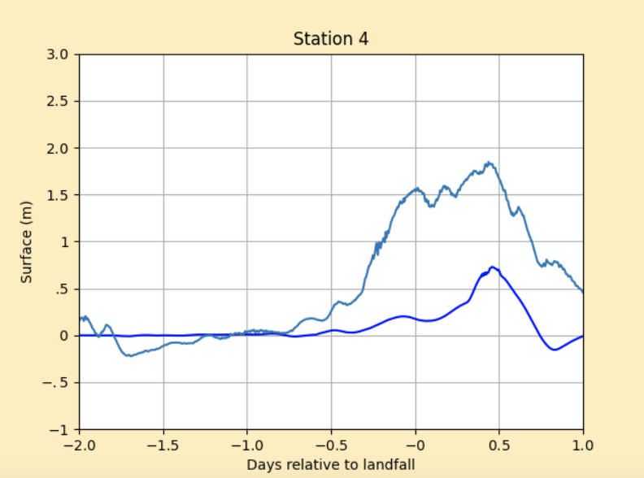
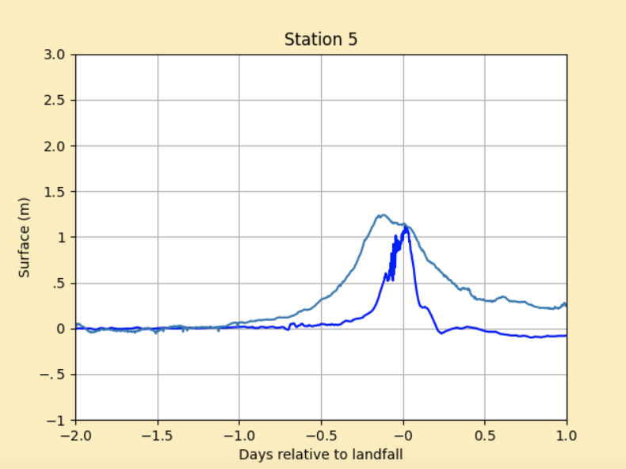

# Storm Report: Hurricane Ida `AL092021`
This folder contains two python files (setrun.py, setplot.py) and one Makefile to simulate storm bevavior of hurricane Ida in August 2021.

## Table of contents
- [Hurricane Ida Information](#hurricane-ida-information)
  * [Path & Landfall](#path--landfall)
  * [Storm surge](#storm-surge)
  * [Rainfall & Flooding](#rainfall--flooding)
- [General Code Execution Guide](#general-code-execution-guide)
- [Topography & Bathymetry Data](#topography--bathymetry-data)
- [Storm Data](#storm-data)
- [GeoClaw Parameters](#geoclaw-parameters)
  * [Landfall & Time Range](#landfall--time-range)
  * [Guages](#guages)
  * [AMRClaw](#amrclaw)
- [Observed Surge Data](#observed-surge-data)
- [Validation Result](#validation-result)
  * [Station 1-Pilots Station East, LA](#station-1-pilots-station-east-la)
  * [Station 2-Grand Isle, LA](#station-2-grand-isle-la)
  * [Station 3-Eugene Island, LA](#station-3-eugene-island-la)
  * [Station 4-Bay Waveland Yacht Club, LA](#station-4-bay-waveland-yacht-club-la)
  * [Station 5-Port Fourchon, LA](#station-5-port-fourchon-la)
  * [Result Interpretation](#result-interpretation)
- [Conclusion](#conclusion)

## Hurricane Ida Information

### Path & Landfall
Ida was a category 4 hurricane. It caused severe damage when it made landfall in southeastern Louisiana before its landfall in western Cuba as a category 1 hurricane. Ida later became an extratropical low that caused heavy rain and deadly flooding in the northeastern United States.

### Storm surge
Ida produced a very severe storm surge that penetrated inland from the immediate coastline across portions of southeastern Louisiana, including on both the east and west banks of the Mississippi River and bordering portions of Lake Pontchartrain. Storm surge levels were enough high in some areas to overtop local levee systems. 

### Rainfall & Flooding
Generally speaking, Ida produced widespread rainfall along its path. Ida produced widespread heavy rains along portions of the northern Gulf coast states. Rainfall totals of more than 10 inches occurred over portions of southeastern Louisiana, southeastern Mississippi, and southwestern Alabama. Rainfall totals of 5 to 9 inches over eastern Mississippi, southwestern Alabama, and the western Florida Panhandle. The heavy rainfall produced freshwater flooding, especially in southeastern Louisiana and in southeastern Mississippi.


*Reference: National Hurricane Center Tropical Cyclone Report*
(https://www.nhc.noaa.gov/data/tcr/AL092021_Ida.pdf)

## General Code Execution Guide
If running this example, download setrun.py, setplot.py, and Makefile to the appropriate directory. Execute `$ make all` or `$ make .plots` to compile the code, run the simulation, and plot the results. If problems will be encountered, please refer to <a href="http://www.clawpack.org/quick_surge.html" target="_blank">Storm Surge Guide</a> for possible solutions. 

## Topography & Bathymetry Data
Topography data can be obtained from:
https://www.gebco.net/data_and_products/gridded_bathymetry_data/

Topography file used for this example is stored in professor Kyle Mandli's website and can be fetched in setrun.py by modifying codes in topography section similar to this:
```python
# Fetch topo data
clawutil.data.get_remote_file(
           "http://www.columbia.edu/~ktm2132/bathy/gulf_caribbean.tt3.tar.bz2")
```

## Storm Data
Storm specific data for Hurricane Ida was retrieved from NOAA’s storm data archive:
http://ftp.nhc.noaa.gov/atcf/archive/2021/bal092021.dat.gz

In setrun.py, data can be directly fetched by modifying codes in storm data section similar to this:
```python
# Convert ATCF data to GeoClaw format
clawutil.data.get_remote_file(“http://ftp.nhc.noaa.gov/atcf/archive/2021/bal092021.dat.gz”)
atcf_path = os.path.join(data_dir, “bal092021.dat”)
```

## GeoClaw Parameters
### Landfall & Time Range
Time of landfall was set in the simulation to be 29 August, 1700 UTC. Time range of simulation was set to be 2 days (48 hours) before landfall and 1 day (24 hours) after landfall.
### Guages
Gauges were selected in the NOAA Inundations dashboard:
https://tidesandcurrents.noaa.gov/map/index.html
### AMRClaw
AMRClaw is a very powerful algorithm to refine areas for analysis. After merging the algorithm in setrun.py, we will be able to have a high resolution of regions which will effectively solve bad simulation curves by GeoClaw due to wrongly appeared dry cells from low resolution. One can include or exclude AMRClaw algorithm by modifying codes in setrun.py similar to
```python
from clawpack.clawutil import clawdata
rundata = clawdata.ClawRunData(claw_pkg, num_dim)
```
One may also want to modify AMR parameters like `amr_levels_max` and `refinement_ratios` in a more customized way. In this example, `amr_levels_max` was set to be `6` and `refinement_ratios` was set to be `[2, 2, 2, 3, 4, 4]`. Note that for this specific example, Mississippi River Delta region was very hard to refine due to its extremely complicated and detailed topography. Therefore, high refinement levels are not recommended because run time may increase exponentially without making much progress. More information regarding refinement parameter can be found in the documentation here: <a href="https://www.clawpack.org/setrun_amrclaw.html#setrun-amrclaw" target="_blank">AMRClaw Information</a>.

## Observed Surge Data
To compare simulation surge data by GeoClaw, we introduced the observed surge data using `clawpack.geoclaw.util.fetch_noaa_tide_data` along with each guage's station ID. When plotting the observed surge data, we explicitly deduct the tide amount from sea level at each location to make the data solely representing storm surge.

## Validation Result
### Station 1-Pilots Station East, LA
Pilots Station East, LA `ID: 8760922` experienced a storm surge of approximately 1.40 meter. GeoClaw predicted approximately 0.45 meters. 



### Station 2-Grand Isle, LA
Grand Isle, LA `ID: 8761724` experienced a storm surge of approximately 1.65 meter. GeoClaw predicted approximately 2.80 meters. 



### Station 3-Eugene Island, LA
Eugene Island, LA `ID: 8764314` experienced a storm surge of approximately -0.40 meter. GeoClaw predicted approximately -0.45 meters. 



### Station 4-Bay Waveland Yacht Club, LA
Bay Waveland Yacht Club, LA `ID: 8747437` experienced a storm surge of approximately 2.25 meter. GeoClaw predicted approximately 0.75 meters. 



### Station 5-Port Fourchon, LA
Port Fourchon, LA `ID: 8762075` experienced a storm surge of approximately 1.45 meter. GeoClaw predicted approximately 1.10 meters. 



### Result Interpretation
Among all gauge locations, station 1, 2, 4, and 5 are to the right of the hurricane eye when Ida passed the Mississippi River Delta region, and we expected and observed positive surges in water level. For station 3, since it's to the left of the hurricane eye, a negative surge was observed and expected. Timing and pattern of storm surges obtained from GeoClaw were generally consistent with the observed data. Since hurricane Ida was a category 4 hurricane which generated severe rainfall and freshwater flooding, differences between observed data and simulation data are reasonable and acceptable. More elaboration is needed for station 2 because it's the only station that surge from simulation is higher than observed ones. The reason for that is the gauge location at Grand Isle is in a small pier surrounded by land. So it's nearly impossible to refine the region as specific as we need. Consequently, the location of station 2 for simulation was set in the nearest open water, and the abnormality can be explained because the land prevented the water from getting inside. Also, surge pattern of station 4 is not as good as other gauges because station 4 is located at a narrow pass of the mississippi river which cannot be refined in a reasonable time given author's current hardware setup.

## Conclusion
Generally speaking, observed data and simulation data share large amount of similarty in timing and pattern of surges. Two major reasons for the differences between the two data or abnormality are highly likely to be rainfall & freshwater flooding caused by the hurricane which was not taken into account by GeoClaw, and low/bad refinement of topography. Note that for this specific example, Mississippi River Delta region has lots of tiny islands and narrow waterways, making it very hard to refine. For future executions of this example, user may need to fully consider the pros (possibility of better refined regions) and cons (low efficiency in terms of run time) when adding more refinement levels.


Author: Jinpai (Max) Zhao
```
jz3445@columbia.edu
```
