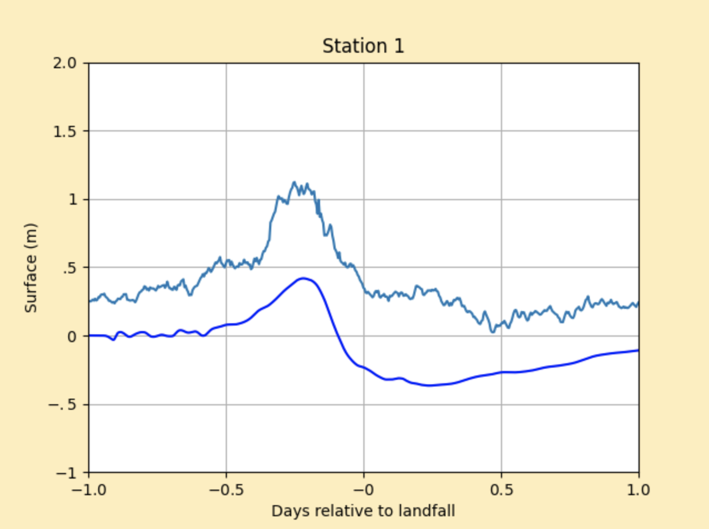
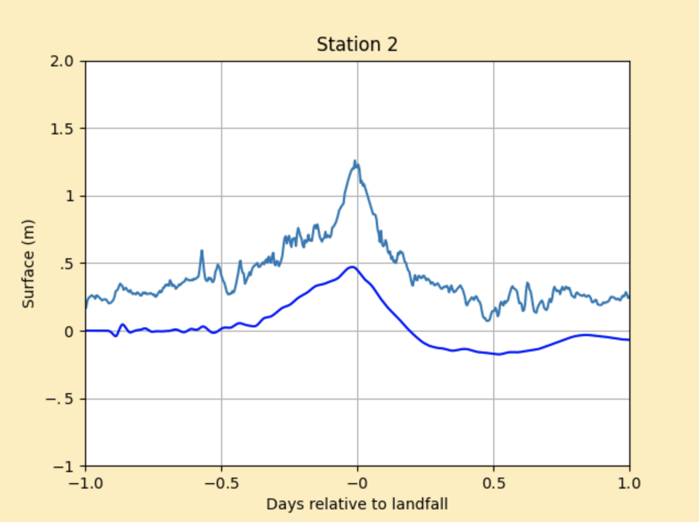
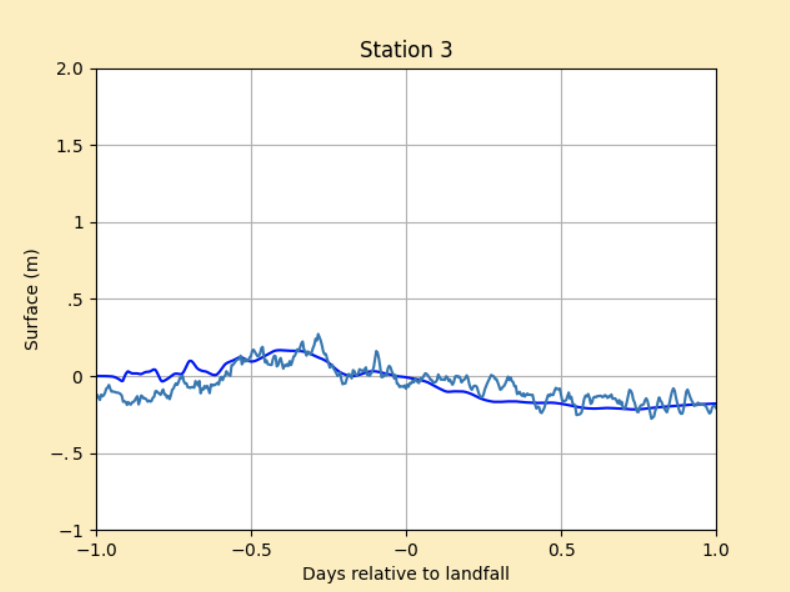
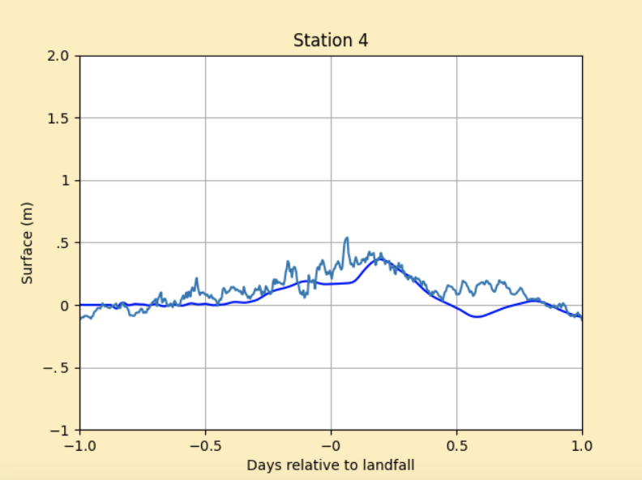
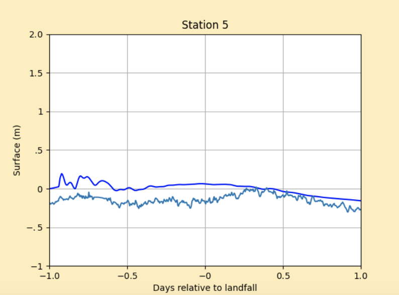
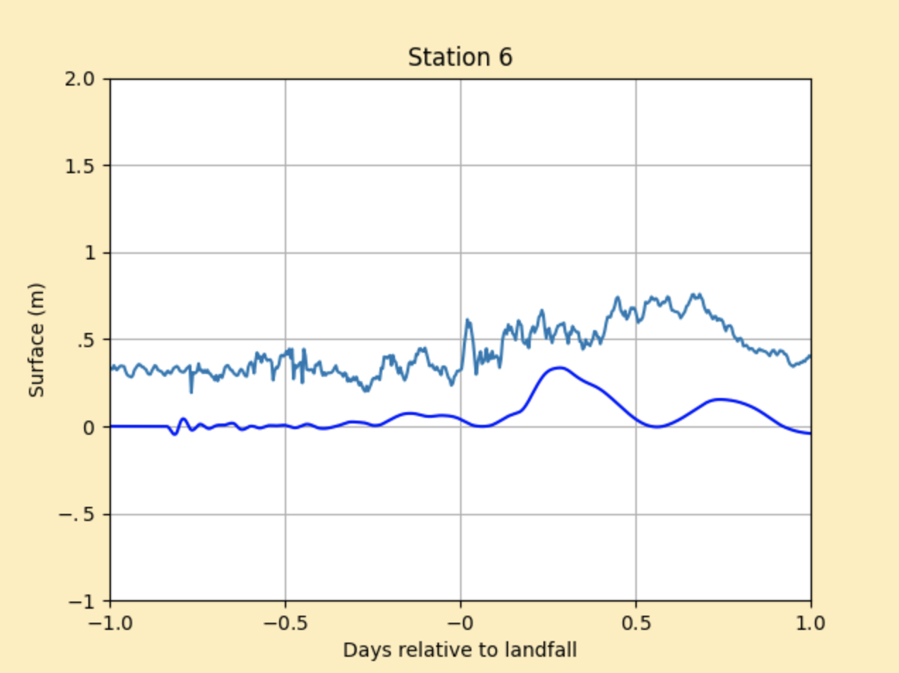

# Storm Report: Hurricane Nicholas `AL142021`
This folder contains two python files (setrun.py, setplot.py) and one Makefile to simulate storm bevavior of hurricane Nicholas in September 2021.

## Table of contents
- [Hurricane Nicholas Information](#hurricane-nicholas-information)
  * [Path & Landfall](#path--landfall)
  * [Storm surge](#storm-surge)
  * [Rainfall & Flooding](#rainfall--flooding)
- [General Code Execution Guide](#general-code-execution-guide)
- [Topography & Bathymetry Data](#topography--bathymetry-data)
- [Storm Data](#storm-data)
- [GeoClaw Parameters](#geoclaw-parameters)
  * [Landfall & Time Range](#landfall--time-range)
  * [Guages](#guages)
  * [AMRClaw](#amrclaw)
- [Observed Surge Data](#observed-surge-data)
- [Validation Result](#validation-result)
  * [Station 1-Matagorda Bay Entrance Channel, TX](#station-1-matagorda-bay-entrance-channel-tx)
  * [Station 2-Freeport Harbor, TX](#station-2-freeport-harbor-tx)
  * [Station 3-Aransas Pass, TX](#station-3-aransas-pass-tx)
  * [Station 4-Galveston Bay Entrance, TX](#station-4-galveston-bay-entrance-tx)
  * [Station 5-SPI Brazos Santiago, TX](#station-5-brazos-santiago-tx)
  * [Station 6-Texas Point, TX](#station-6-texas-point-tx)
  * [Result Interpretation](#result-interpretation)
- [Conclusion](#conclusion)

## Hurricane Nicholas Information
### Path & Landfall
Nicholas was a Category 1 hurricane. It made landfall on the eastern portion of the Matagorda Peninsula in Texas. The cyclone then moved slowly over eastern Texas and Louisiana while weakening, producing heavy rainfall and flooding across the southeastern United States.

### Storm surge
The highest storm surge detected from hurricane Nicholas was 4.30 ft above normal tide levels at a NOS tide gauge at Morgans Point, Texas. A storm surge of 4.13 ft above normal tide levels was also measured by a gauge at Freeport Harbor, Texas. The highest inundation occurred in Brazoria, Galveston, and Harris Counties. In Mississippi, a maximum water level of 3.3 ft MHHW was recorded by the gauge at the Bay Waveland Yacht Club, about 12 hours after the storm had become a tropical depression. In Louisiana, peak water levels of 2.7 ft and 2.6 ft MHHW were measured by NOS gauges at Amerada Pass and Shell Beach.

### Rainfall & Flooding
The moisture associated with Nicholas spread across coastal sections of southeastern Texas by 12 September as the cyclone passed east of the area. The heaviest rainfall in Texas occurred after hurricane Nicholas's landfall on 14 September and its forward motion has slowed down. It spent much of that day crossing the Houston/Galveston metropolitan area. Across this region, a large region experienced 4 to 9 inches rainfall.

*Reference: National Hurricane Center Tropical Cyclone Report*
(https://www.nhc.noaa.gov/data/tcr/AL142021_Nicholas.pdf)

## General Code Execution Guide
If running this example, download setrun.py, setplot.py, and Makefile to the appropriate directory. Execute `$ make all` or `$ make .plots` to compile the code, run the simulation, and plot the results. If problems will be encountered, please refer to <a href="http://www.clawpack.org/quick_surge.html" target="_blank">Storm Surge Guide</a> for possible solutions. (Approximate runtime for this example on Monterey quad-Core intel core: 40 min)

## Topography & Bathymetry Data
Topography data can be obtained from:
https://www.gebco.net/data_and_products/gridded_bathymetry_data/

Topography file used for this example is stored in professor Kyle Mandli's website and can be fetched in setrun.py by modifying codes in topography section similar to this:
```python
# Fetch topo data
clawutil.data.get_remote_file(
           "http://www.columbia.edu/~ktm2132/bathy/gulf_caribbean.tt3.tar.bz2")
```

## Storm Data
Storm specific data for Hurricane Elsa was retrieved from NOAA’s storm data archive:
http://ftp.nhc.noaa.gov/atcf/archive/2021/bal142021.dat.gz

In setrun.py, data can be directly fetched by modifying codes in storm data section similar to this:
```python
# Convert ATCF data to GeoClaw format
clawutil.data.get_remote_file(“http://ftp.nhc.noaa.gov/atcf/archive/2021/bal142021.dat.gz”)
atcf_path = os.path.join(data_dir, “bal142021.dat”)
```

## GeoClaw Parameters
### Landfall & Time Range
Time of landfall was set in the simulation to be 14 September, 0530 UTC. Time range of simulation was set to be 1 days (24 hours) before landfall and 1 day (24 hours) after landfall.
### Guages
Gauges were selected in the NOAA Inundations dashboard:
https://tidesandcurrents.noaa.gov/map/index.html
### AMRClaw
AMRClaw is a very powerful algorithm to refine areas for analysis. After merging the algorithm in setrun.py, we will be able to have a high resolution of regions which will effectively solve bad simulation curves by GeoClaw due to wrongly appeared dry cells from low resolution. One can include or exclude AMRClaw algorithm by modifying codes in setrun.py similar to
```python
from clawpack.clawutil import clawdata
rundata = clawdata.ClawRunData(claw_pkg, num_dim)
```
One may also want to modify AMR parameters like `amr_levels_max` and `refinement_ratios` in a more customized way. In this example, `amr_levels_max` was set to be `6` and `refinement_ratios` was set to be `[2, 2, 2, 3, 3, 4]`. Since all six guages selected for this example are close to each other, instead of using six regions of refinement around each guage, one big region of refinement at north west gulf of Mexico was added. Also, current max level of refinement for this region is set to be 5 for program efficiency. More information regarding parameter can be found in the documentation here: <a href="https://www.clawpack.org/setrun_amrclaw.html#setrun-amrclaw" target="_blank">AMRClaw Information</a>.

## Observed Surge Data
To compare simulation surge data by GeoClaw, we introduced the observed surge data using `clawpack.geoclaw.util.fetch_noaa_tide_data` along with each guage's station ID. When plotting the observed surge data, we explicitly deduct the tide amount from sea level at each location to make the data solely representing storm surge.

## Validation Result
### Station 1-Matagorda Bay Entrance Channel, TX
Matagorda Bay Entrance Channel, TX `ID: 8773767` experienced a storm surge of approximately 1.15 meter. GeoClaw predicted approximately 0.40 meters. 



### Station 2-Freeport Harbor, TX
Freeport Harbor, TX `ID: 8772471` experienced a storm surge of approximately 1.25 meter. GeoClaw predicted approximately 0.50 meters. 



### Station 3-Aransas Pass, TX
Aransas Pass, TX `ID: 8775241` experienced a storm surge of approximately 0.60 meter. GeoClaw predicted approximately 0.20 meters. 



### Station 4-Galveston Bay Entrance, TX
Galveston Bay Entrance, TX `ID: 8771341` experienced a storm surge of approximately 0.90 meter. GeoClaw predicted approximately 0.40 meters. 



### Station 5-SPI Brazos Santiago, TX
SPI Brazos Santiago, TX `ID: 8779749` experienced a storm surge of approximately 0.40 meter. GeoClaw predicted approximately 0.10 meters. 



### Station 6-Texas Point, TX
Texas Point, TX `ID: 8770822` experienced a storm surge of approximately 0.75 meter. GeoClaw predicted approximately 0.40 meters. 



### Result Interpretation
Differences in surface level are reasonable and acceptable at Matagorda Bay Entrance, Freeport Harbor, and Aransas Pass. Timing and pattern of storm surges obtained from GeoClaw were generally consistent with the observed data at these gauges. The reason for the differences may come from the rainfall by hurricane Nicholas. However at gauge Galveston Bay Entrance, SPI Brazos Santiago, and Texas Point, timing and pattern of storm surge from simulation does not match observed data as evidently as the first three stations. Other than rainfall and flooding, topography could be the main problem for the latter three gauges. To elaborate, gauge at Texas Point lies in the channel between Texas and Louisiana. Gauge at Galveston Bay Entrance is coverd by Galveston island. Gauge at SPI Brazos Santiago is also covered by the south end of the South Padre Island. It is very hard to recover the exact locations with surrounding topography of these three gauges given all the tiny details. One might want to further refine the regions of those gauges using higher refinement levels in sacrifice of run time to obtain better results.

## Conclusion
Generally speaking, timing and pattern of storm surges obtained from GeoClaw were consistent with the observed data. Inconsistencies at some gauges may due to low resolution or difficulty of simulating extremely detailed topography. Most observed storm surges slightly exceeded the amount of which from GeoClaw simulation, and the reason may likely correspond to the rainfall and flooding caused by hurricane Nicholas which was not taken into account by GeoClaw simulation. 


Author: Jinpai (Max) Zhao
```
jz3445@columbia.edu
```
