# Storm Report: Hurricane Sally AL192020

The three files in this folder (setrun.py, setplot.py, and Makefile) are necessary to run Clawpack simulations of Hurricane Sally in September 2020.

## Table of Contents
- [Hurricane Sally Information](#hurricane-sally-information)
  * [Path & Landfall](#path--landfall)
  * [Storm Surge](#storm-surge)
  * [Rainfall & Flooding](#rainfall--flooding)
- [Topography & Bathymetry Data](#topography--bathymetry-data)
- [Storm Data](#storm-data)
- [GeoClaw Parameters](#geoclaw-parameters)
  * [Landfall & Time Range](#landfall--time-range)
  * [Gauges](#gauges)
  * [AMRClaw](#amrclaw)
  * [Refinement Regions](#refinement-regions)
- [Observed Surge Data](#observed-surge-data)
- [Validation Result](#validation-result)
  * [Map](#map)
  * [Station 1 - Pensacola, FL](#station-1-pensacola-fl)
  * [Station 2 - Dauphin Island, AL](#station-2-dauphin-island-al)
  * [Station 3 - Bayou La Batre Bridge, AL](#station-3-bayou-la-batre-bridge-al)
  * [Station 4 - East Fowl River Bridge, AL](#station-4-east-fowl-river-bridge-al)
  * [Station 5 - Dog River Bridge, AL](#station-5-dog-river-bridge-al)
  * [Station 6 - Coast Guard Sector Mobile, AL](#station-6-coast-guard-sector-mobile-al)
  * [Station 7 - West Fowl River Bridge, AL](#station-7-west-fowl-river-bridge-al)
  * [Station 8 - Pascagoula NOAA Lab, MS](#station-8-pascagoula-noaa-lab-ms)
  * [Station 9 - Bay Waveland Yacht Club, MS](#station-9-bay-waveland-yacht-club-ms)
  * [Station 10 - Shell Beach, LA](#station-10-shell-beach-la)
  * [Result Interpretation](#result-interpretation)
  * [Comparison of Simulation to Gauge Station Data](#comparison-of-simulation-to-gauge-station-data)
- [Conclusion](#conclusion)

## Hurricane Sally Information

All information and analysis was acquired from The National Hurricane Center (NHC) Tropical Cyclone Report under the National Oceanic and Atmospheric Administration (NOAA), which can be found here: https://www.nhc.noaa.gov/data/tcr/AL192020_Sally.pdf

## Path & Landfall

Hurricane Sally was a category 2 hurricane that made landfall along the coast of Alabama and the western Florida Panhandle around 0945 UTC (0545 EST) on September 16, 2020. (While it also intersected with the Floridian peninsula, there was on significant coastal flooding there as the storm was a tropical depression and was transitioning to a tropical storm at that time.) Hurricane Sally created a complex pattern of storm surge flooding along much of the central and northeastern US Gulf coast, and record river flooding resulting from heavy rainfall. The storm continued across Alabama and Georgia and dissipated in South Carolina.

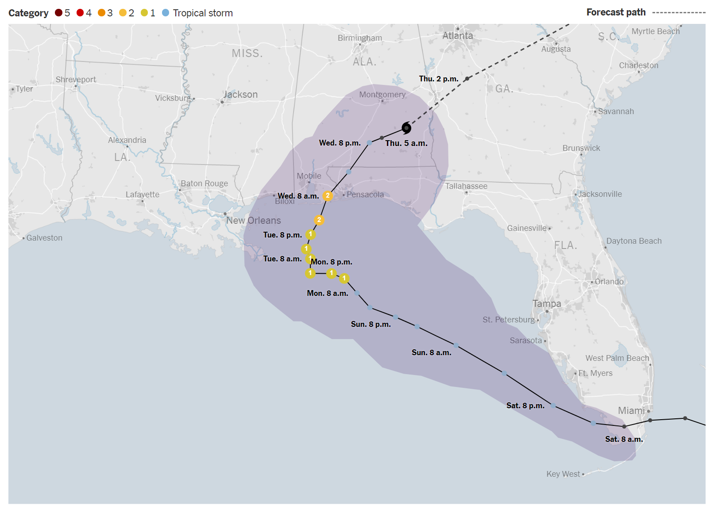

Image Source: https://www.nytimes.com/interactive/2020/09/14/us/hurricane-sally-map.html

## Storm Surge

Storm surge is defined as the abnormal rise of water generated by a storm, above the predicted astronomical tide, and is expressed in terms of height above normal tide levels. 

According to the NOAA report for Hurricane Sally:
> Sally’s erratic track near the complex shoreline of the northern Gulf coast produced a multifaceted storm surge event, with some areas experiencing flooding followed by a period of abnormally low water due to offshore winds on the backside of the hurricane. The combination of the surge and tides produced maximum inundation levels of 5 to 7 ft above ground level along the coasts of Baldwin County, Alabama, and Escambia and Santa Rosa Counties Florida. The highest water level measured in the area was from the NOS tide gauge in Pensacola which recorded a peak water level of 5.6 ft above Mean Higher High Water (MHHW)...Storm surge flooding of 3 to 5 ft above ground level occurred to the west of Sally’s landfall location along the Alabama coast, the Mississippi coast, and in southeastern Louisiana…Probably more noteworthy around Mobile Bay was the reverse surge event that occurred on the backside of Sally’s circulation once the winds turned out of the north.


## Rainfall & Flooding

Sally’s slow motion across the northern Gulf resulted in high rainfall totals that caused significant flooding across parts of southern Alabama and the Florida Panhandle. The highest reported rainfall total was 29.99 inches at Orange Beach, Alabama, and the highest amount recorded in Florida was 24.88 inches near Naval Air Station Pensacola.

From the NOAA Hurricane Report:

> Freshwater flooding across southern Alabama and the western Florida Panhandle was exacerbated by storm surge, which prevented rainwater from draining into adjacent tidal rivers, bays, or the Gulf of Mexico. Major-to-moderate flooding occurred along many rivers, with several river gauges measuring their highest level on record.

## Topography & Bathymetry Data

Topography data was obtained from: https://download.gebco.net/

For the topography file used in this example, the latitude range was 20 to 37, and the longitude range was from -96 to -70. An ASCII Grid file was used.

The topography file was placed in a ‘scratch’ directory defined in the beginning of the setrun.py:
```
# Scratch directory for storing topo and storm files:
scratch_dir = os.path.join(os.environ["CLAW"], 'geoclaw', 'scratch')
```
“CLAW” refers to an environment variable that gives the full path to clawpack. (More information can be found at https://www.clawpack.org/setenv.html.)


## Storm Data

Hurricane Sally storm data was obtained from NOAA’s storm data archive:
https://ftp.nhc.noaa.gov/atcf/archive/2020/bal192020.dat.gz

Data is fetched from the following code segment in setrun.py: 
```
# Convert ATCF data to GeoClaw format
clawutil.data.get_remote_file("https://ftp.nhc.noaa.gov/atcf/archive/2020/bal192020.dat.gz")
atcf_path = os.path.join(scratch_dir, "bal192020.dat")
```
This places the storm data in the same scratch directory defined for the topography data.


## GeoClaw Parameters

Parameters for the Hurricane Sally simulation were set in setrun.py.

### Landfall & Time Range

The time of landfall was set in the simulation to be 16 September, 900 UTC. The time range of the simulation was set to be -4.5 days before landfall and 2 days after landfall.

Date and time of landfall is set in the following code segment in setrun.py:
```
# Time of landfall
sally.time_offset = datetime.datetime(2020, 9, 16, 9)
```

Initial time is set in the following code segment in setrun.py:
```
# -------------
# Initial time:
# -------------
clawdata.t0 = days2seconds(-4.5)
```

Final time is set in the following code segment in setrun.py:
```
if clawdata.output_style == 1:
  # Output nout frames at equally spaced times up to tfinal:
  clawdata.tfinal = days2seconds(2)
  recurrence = 24 # Number of frames of output per day
```

### Gauges

Ten gauges were selected mainly near the coast of Alabama, along with some in Florida, Mississippi, and Louisiana, using the NOAA Inundations dashboard: https://tidesandcurrents.noaa.gov/map/index.html.

Both setrun.py and setplot.py read in gauges from a file called “gauges.csv” placed in the scratch directory. The columns prefaced with “Original” refer to the coordinates of the tide gauges as written on the NOAA website. The columns “Latitude Decimal” and “Longitude Decimal” have been modified from the original locations slightly because the original locations were often too close to the coast to be recognized as being in the water at low refinement levels. The only columns necessary to run the code are Number, Latitude Decimal, and Longitude Decimal, located in their respective columns.

Gauge Number | Full Name | ID | Location | Original Latitude (Degrees) | Original Latitude (Minutes) | Latitude (Decimal) | Original Longitude (Degrees) | Original Longitude (Minutes) | Longitude (Decimal)
--- | --- | --- | --- | --- | --- | --- | --- | --- | --- |
1 | 8729840 Pensacola, FL | 8729840 | Pensacola, FL | 30 | 24.3 | 30.39970949 | 87 | 12.7 | -87.21245971
2 | 8735180 Dauphin Island, AL | 8735180 | Dauphin Island, AL | 30 | 15 | 30.25629541 | 88 | 4.5 | -88.06874935
3 | 8739803 Bayou La Batre Bridge, AL | 8739803 | Bayou La Batre Bridge, AL | 30 | 24.4 | 30.31587042 | 88 | 14.9 | -88.32339676
4 | 8735523 East Fowl River Bridge, AL | 8735523 | East Fowl River Bridge, AL | 30 | 26.6 | 30.44810956 | 88 | 6.8 | -88.07740624
5 | 8735391 Dog River Bridge, AL | 8735391 | Dog River Bridge, AL | 30 | 33.9 | 30.56404078 | 88 | 5.3 | -88.03923595
6 | 8736897 Coast Guard Sector Mobile, AL | 8736897 | Coast Guard Sector Mobile, AL | 30 | 39 | 30.62122105 | 88 | 3.5 | -88.02901464
7 | 8738043 West Fowl River Bridge, AL | 8738043 | West Fowl River Bridge, AL | 30 | 22.6 | 30.26680326 | 88 | 9.5 | -88.25807891
8 | 8741533 Pascagoula NOAA Lab, MS | 8741533 | Pascagoula NOAA Lab, MS | 30 | 22.1 | 30.32783450 | 88 | 33.8 | -88.55421872
9 | 8747437 Bay Waveland Yacht Club, MS | 8747437 | Bay Waveland Yacht Club, MS | 30 | 19.6 | 30.28681810 | 89 | 19.5 | -89.31696328
10 | 8761305 Shell Beach, LA | 8761305 | Shell Beach, LA | 29 | 52.1 | 29.87512048 | 89 | 40.4 | -89.67288923

### AMRClaw

AMR (adaptive mesh refinement) was used to refine areas for analysis. Using this algorithm allows us to gain a higher resolution of regions to solve bad simulation curves by GeoClaw.

The following code in setrun.py can be used to include or exclude the AMRClaw algorithm:
```
from clawpack.clawutil import data
assert claw_pkg.lower() == 'geoclaw',  "Expected claw_pkg = 'geoclaw'"
num_dim = 2
rundata = data.ClawRunData(claw_pkg, num_dim)
```

AMR parameters are also set/modified in setrun.py.

The maximum number of refinement levels was set to 5:
```
# Max number of refinement levels:
amrdata.amr_levels_max = 5
```

Refinement ratios were set with:
```
# List of refinement ratios at each level (length at least mxnest-1)
amrdata.refinement_ratios_x = [2, 2, 2, 8, 16]
amrdata.refinement_ratios_y = [2, 2, 2, 8, 16]
amrdata.refinement_ratios_t = [2, 2, 2, 8, 16]
```

Refinement Regions: In order to maximize computing power and ensure refinement in relevant areas, regions were defined with a maximum and minimum refinement level. The minimum refinement level around the storm’s landfall was set as 4, and the maximum level was set as 5. In all surrounding regions, the minimum was set as 1 and the maximum was set as 3. In setrun,py:
```
# == setregions.data values ==
regions = rundata.regiondata.regions


# To specify regions of refinement append lines of the form
# [minlevel,maxlevel,t1,t2,x1,x2,y1,y2]
# (Entire map has coordinates -95 -71 21 36)
regions.append([4, 5, clawdata.t0, clawdata.tfinal, -90, -86, 29, 31]) # Storm area
regions.append([1, 2, clawdata.t0, clawdata.tfinal, -95, -71, 21, 24]) # Bottom
# … etc
```

Caution: higher refinement levels may increase the run time exponentially without making much progress. If you are running the program on a more powerful machine, a higher refinement level can be used. 

More information can be found at: https://www.clawpack.org/setrun_amrclaw.html#setrun-amrclaw.

## Observed Surge Data

To compare the simulation surge data by GeoClaw to the actual data, we collected the observed surge data using: `clawpack.geoclaw.util.fetch_noaa_tide_data`. The storm surge data was plotted by subtracting the predicted tide level from the observed sea level at each point in time. In addition, there was a significant initial difference between observed and simulated sea level for each gauge, which was eliminated in plotting the curves.

## Validation Result

### Map

A map of gauges located on the simulation just before the storm reaches landfall:

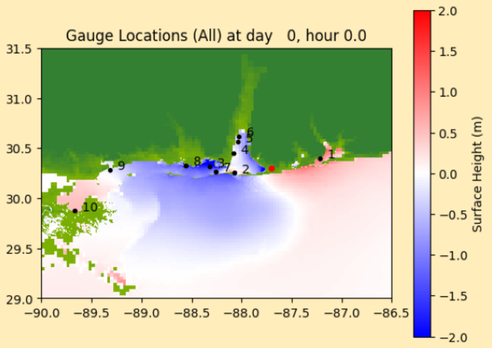

### Station 1 - Pensacola, FL

Pensacola, FL (ID: 8729840) experienced a storm surge of approximately 1.50 meters. GeoClaw predicted approximately 1.20 meters.

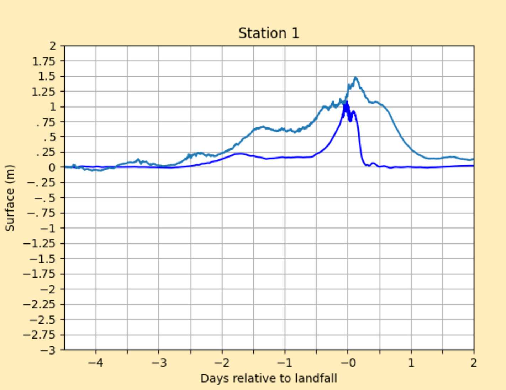

### Station 2 - Dauphin Island, AL

Dauphin Island, AL (ID: 8735180) experienced a storm surge of approximately 0.75 meters, and a reverse storm surge of approximately -0.25 meters. GeoClaw predicted approximately 0.70 meters and -0.80 meters.

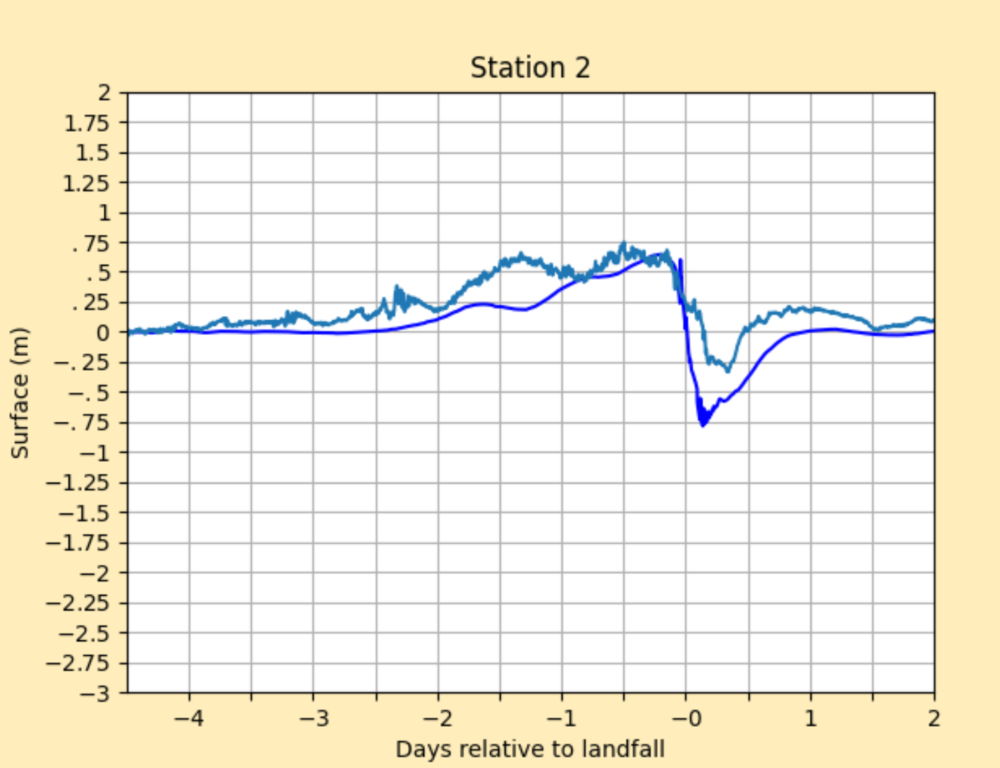

### Station 3 - Bayou La Batre Bridge, AL

Bayou La Batre Bridge, AL (ID: 8739803) experienced a storm surge of approximately -1.05 meters. GeoClaw predicted approximately -1.80 meters.

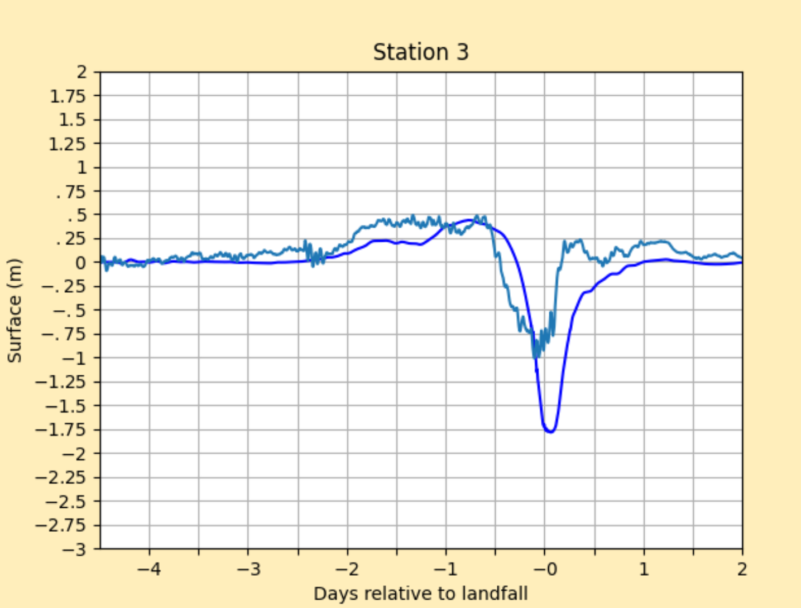

### Station 4 - East Fowl River Bridge, AL

East Fowl River Bridge, AL (ID: 8735523) experienced a storm surge of approximately 0.55 meters and a reverse surge of approximately -1.00 meter. GeoClaw predicted approximately 0.80 meters and -1.30 meters.

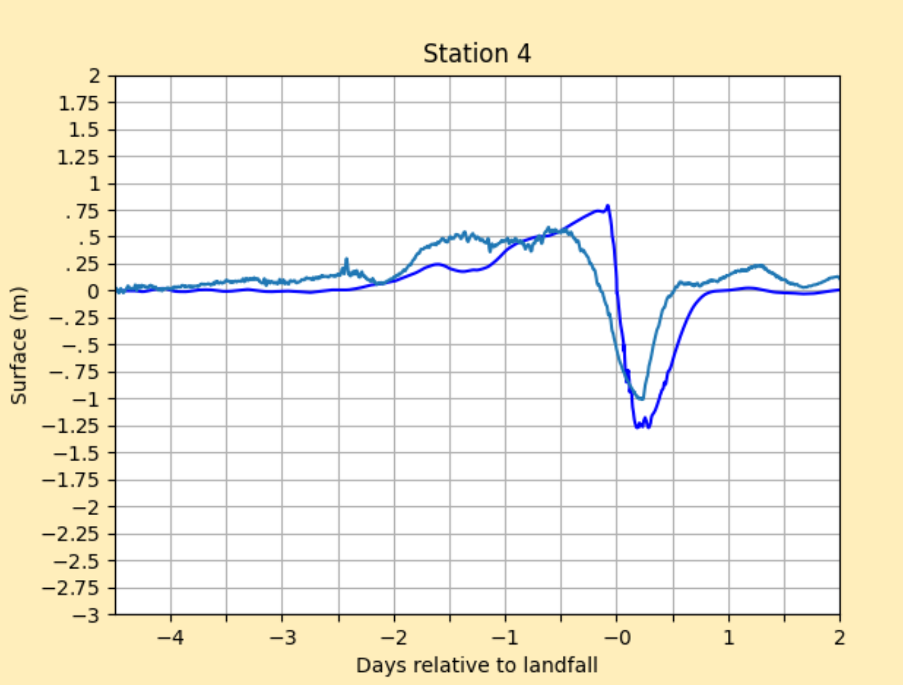

### Station 5 - Dog River Bridge, AL

Dog River Bridge, AL (ID: 8735391) experienced a storm surge of approximately -1.80 meters. GeoClaw predicted approximately -1.65 meters.

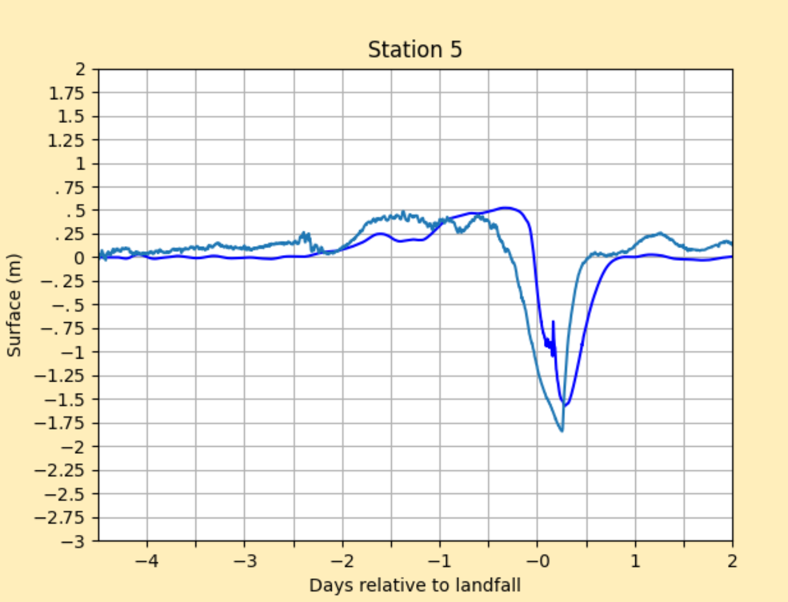

### Station 6 - Coast Guard Sector Mobile, AL

Coast Guard Sector Mobile, AL (ID: 8736897) experienced a storm surge of approximately -2.65 meters. GeoClaw predicted approximately -1.65 meters.

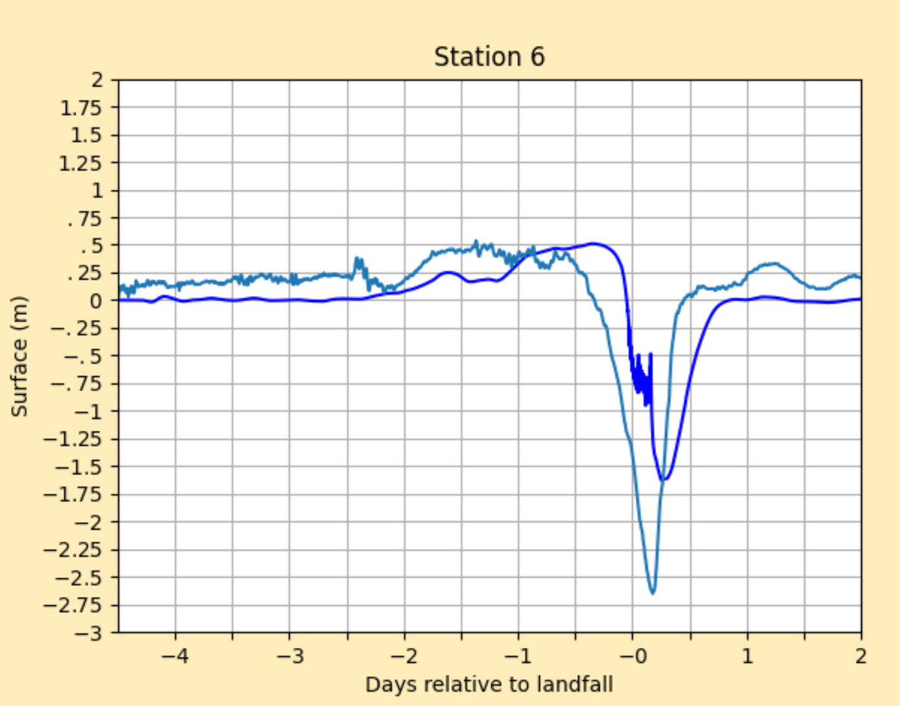

### Station 7 - West Fowl River Bridge, AL

West Fowl River Bridge, AL (ID: 8738043) experienced a storm surge of approximately -0.75 meters. GeoClaw predicted approximately -1.20 meters.

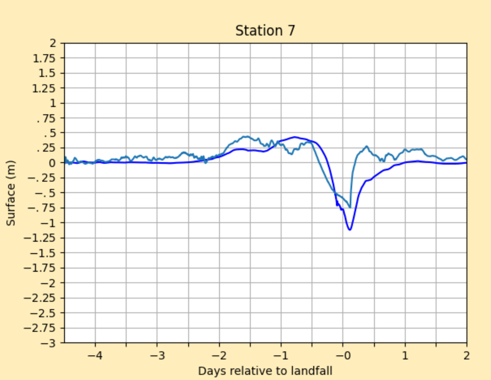

### Station 8 - Pascagoula NOAA Lab, MS

Pascagoula NOAA Lab, MS (ID: 8741533) experienced a storm surge of approximately 0.75 meters and a reverse storm surge of approximately -0.25 meters. GeoClaw predicted approximately 0.50 meters, and -1.75 meters for reverse storm surge.

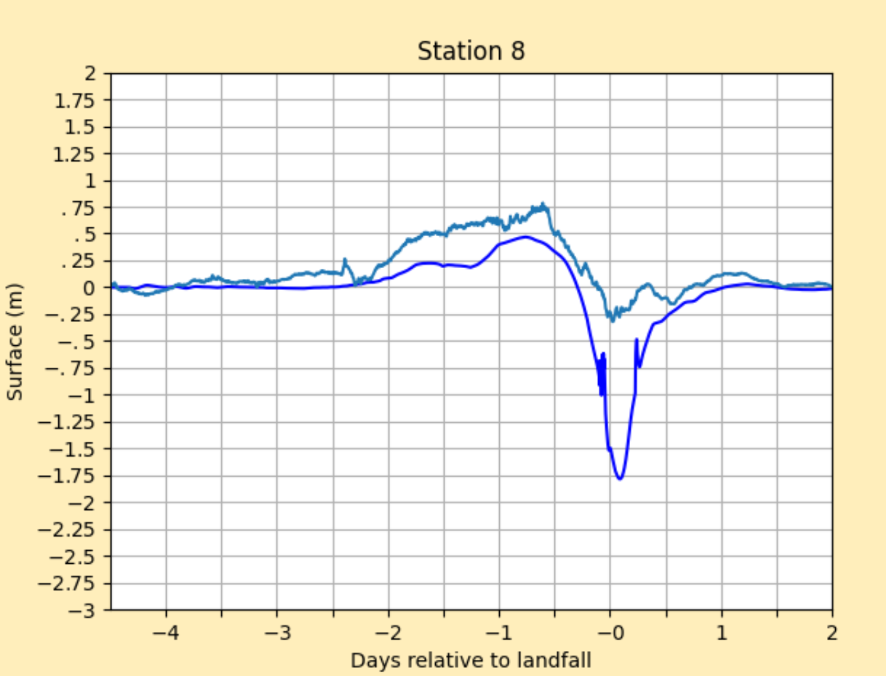

### Station 9 - Bay Waveland Yacht Club, MS

Bay Waveland Yacht Club, MS (ID: 8747437) experienced a storm surge of approximately 0.80 meters, and a reverse storm surge of approximately -0.35 meters. GeoClaw predicted approximately 0.65 meters and -0.60 meters.

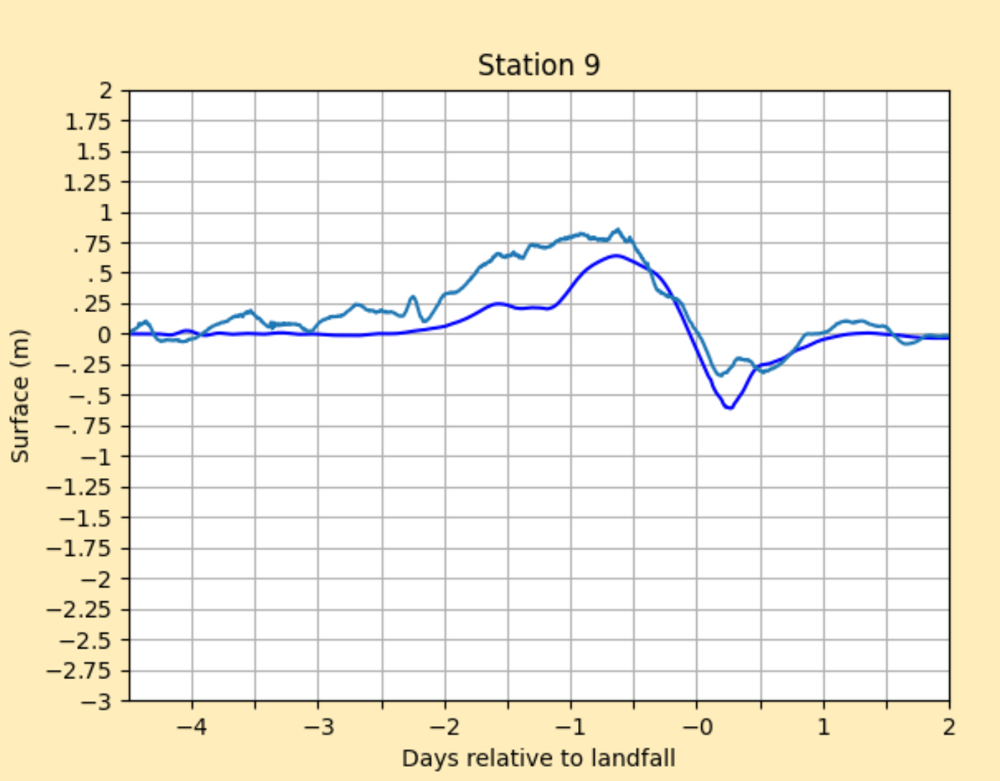

### Station 10 - Shell Beach, LA

Shell Beach, LA (ID: 8761305) experienced a storm surge of approximately 1.25 meters. GeoClaw predicted approximately 1.00 meters.

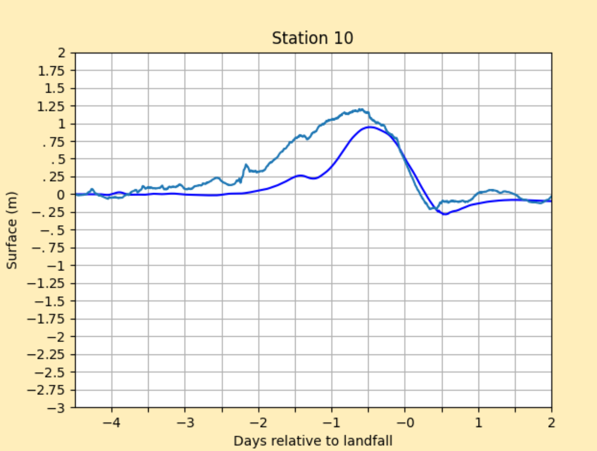

### Result Interpretation

Storm surge typically occurs when hurricane winds blow onshore, and reverse storm surge occurs when winds blow away from the shore, pushing water away from the coast. As hurricanes spin counterclockwise, areas that are located west of the center of the storm tend to exhibit reverse storm surge. This can be seen in the plots of Stations 2-7, which are all located inside or near Mobile Bay, Alabama, which is immediately to the west side of the center of the storm as it makes landfall; the greatest amount of reverse storm surge occurred near Station 6, Coast Guard Sector, Mobile Alabama. Although Stations 9 and 10 (Mississippi and Louisiana coasts) are also located westward from the storm at landfall, they exhibit positive storm surge before the hurricane reaches landfall; for Station 10, this possibly occurred because it is located to the north of the coast (so counterclockwise winds would push the water toward the shore in this case). Conversely, Station 1 (Pensacola, Florida), the only gauge located to the east side of the storm, has the highest recorded levels of positive storm surge.

### Comparison of Simulation to Gauge Station Data

For the most part, the maximum storm surge predicted by the simulations was lower than the actual maximum; however, the times generally coincide. For reverse storm surge, the simulations predicted greater reverse storm surge for some gauges and less for others. The average difference in results for positive storm surge is about 0.208 meters, and for reverse storm surge it is 0.619 meters. Therefore, while GeoClaw is also able to model reverse storm surge, at least for this particular storm and these particular gauges it is somewhat less accurate. Regarding time of storm surge, except Station 1, discrepancies are mostly a result of GeoClaw simulations predicting the storm surge after the real data.

Differences in simulated and real storm surge can be due to a variety of factors depending on the storm and the geography around each gauge. For example, there was significant rainfall in Hurricane Sally, which GeoClaw does not account for; therefore, higher storm surge at certain gauges that was impacted by rainfall may not be accurately represented by the simulations, therefore making simulated storm surges lower. In addition, Stations 2, 4, 5, and 6 are located inside Mobile Bay and therefore may have experienced some effects that were not properly modeled by GeoClaw; Station 6, located deepest in the bay, seems visibly to be the most inaccurate of these. For example, bays can essentially trap storm surge or create a tidal resonance effect, and the small barrier islands around Mobile Bay may also increase the inaccuracy of the simulations as they only appear at high refinements. Furthermore, other than Station 6 the most visibly inaccurate plots for reverse storm surge seem to be those for Stations 3 and 8, which are located to the west of Mobile Bay and surrounded by the Gulf Islands; again due to insufficient refinement, it is possible that GeoClaw predicted reverse storm surges that were too high because it did not fully account for the islands preventing some of the flow of water from leaving the coast. In terms of positive storm surge, GeoClaw’s low prediction in Station 1 (Pensacola, FL) compared to tide gauge data again may have resulted from bay effects in the Pensacola Bay contributing to a greater degree of longer-lasting storm surge that was not accurately modeled. The geography of the regions near Stations 9 and 10 may also account for discrepancies in their plots, as they are both located near the wetlands of Louisiana.

In addition, computational sources of differences in simulated and real data arise from refinement and gauge locations. As a result of tide gauges typically being located very close to the shore and the simulation not being refined enough to recognize their location in the water, many of the gauge locations had to be slightly modified from their exact real locations to let the simulation data be generated. More powerful machines that are able to refine to higher levels while using more precise gauge locations may result in a more accurate simulation.

## Conclusion

A visible analysis of the data indicates that GeoClaw was generally accurate in predicting locations that had storm surge, reverse storm surge, and the times of this occurring. Some differences in results may be attributed to insufficient refinement along with using modified gauge locations, which could be improved through additional simulations. Other sources of discrepancies lie in geophysical phenomena that are not accurately portrayed through the mathematical models that GeoClaw uses.


