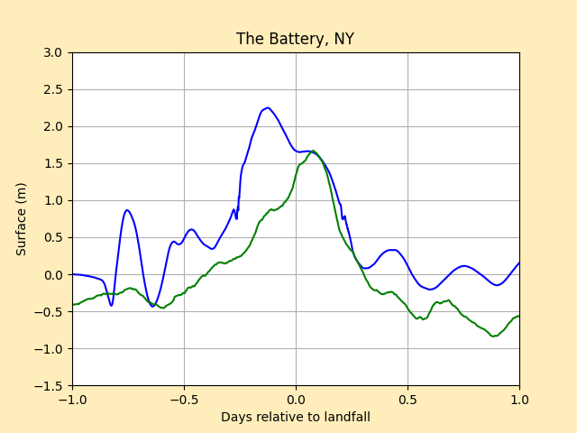
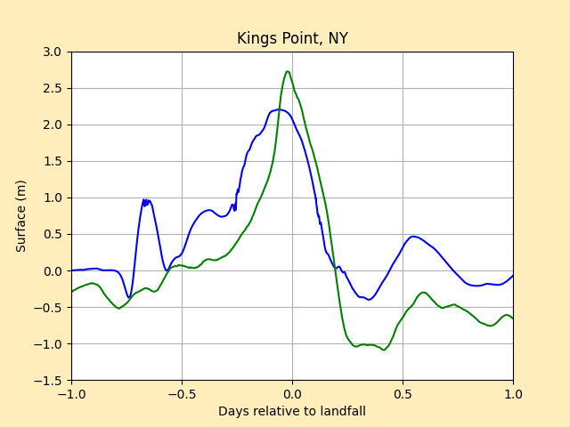
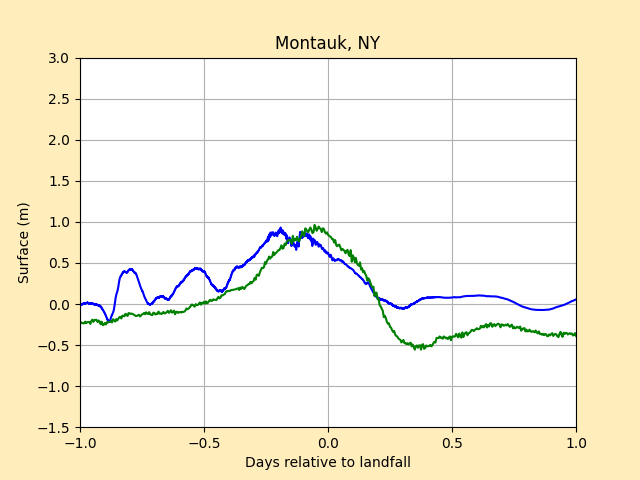
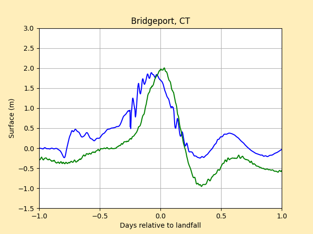
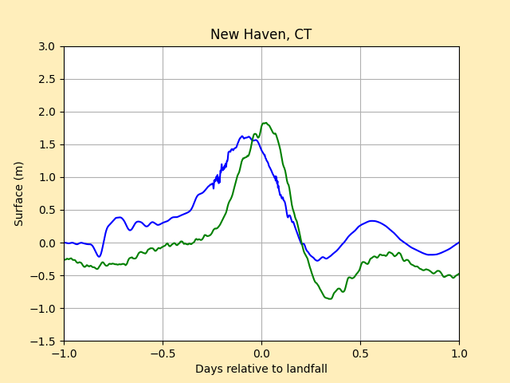
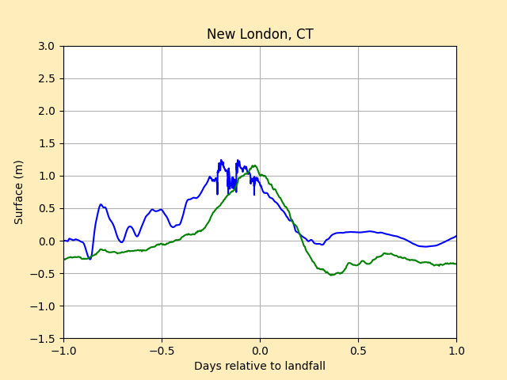

# Hurricane Sandy Storm Report (AL182012)
The folder contains an updated version of the code that simulates Hurricane Sandy.

## General Information About Hurricane Sandy
Hurricane Sandy was a Category 3 hurricane that started out in the southwestern Carribean Sea. The origin of this hurricane is associated with a tropical wave from the west coast of Africa on October 11, 2012. As it traveled north from the Carribean Sea, it made several landfalls on locations like Jamaica and Cuba, where it weakened to a Category 1 hurricane. As it traveled further north, however, it significantly grew in size as it traveled across the Bahamas. It made landfall on 29th of October 2012 at about 23:30 UTC. At the time of landfall, the intensity and the minimum pressure were measured to be 70 kt and 945 mb, respectively. The hurricane gradually weakened as it made its way through New Jersey, Delaware, and Pennsylvania before it finally merged with a low pressure area over eastern Canada. 

*Source: National Hurricane Center Tropical Cyclone Report* (https://www.nhc.noaa.gov/data/tcr/AL182012_Sandy.pdf)

## Storm Data
The storm data file can be found in the NOAA storm data archive website (http://ftp.nhc.noaa.gov/atcf/archive/2012/bal182012.dat.gz)
The following code from ```setrun.py``` will automatically retrieve the file:
``` python
# Convert ATCF data to GeoClaw format
clawutil.data.get_remote_file("http://ftp.nhc.noaa.gov/atcf/archive/2012/bal182012.dat.gz")
atcf_path = os.path.join(scratch_dir, "bal182012.dat")
```
As it is implemented now, the storm data file will be placed in the scratch directory ```$CLAW/geoclaw/scrach```

## Topography & Bathymetry Data
The two topography data files of interest are ```atlantic_1min.tt3``` and ```newyork_3s.tt3```. The files should be placed in the scratch directory ```$CLAW/geoclaw/scrach```

## Geoclaw Parameters
Landfall time: 29 October 2012 23:30 UTC

Gauges:
  1. Battery, NY (8518750)
  2. Kings Point, NY (8516945)
  3. Montauk, NY (8510560)
  4. Bridgeport, CT (8467150)
  5. New Haven, CT (8465705)
  6. New London, CT (8461490)
  
 *All gauge locations are based on NOAA Tides and Currents Dashboard* (https://tidesandcurrents.noaa.gov/map/index.html)

## Results
Results of the simulation is shown below as plots in blue. The horizontal axis shows the days relative to landfall, and the simulation runs from a day before to a day after the landfall indicated in the above section. The vertical axis shows the water surface level in meters. The simulation data can directly be compared with the actual data plotted in green, which was retrieved using ```fetch_noaa_tide_data()``` function. Each of the green plots were shifted down by the mean values of the actual surface levels of the respective gauges in order to account for the mean water levels. The coordinates of some of the gauge locations have been slightly modified to take into account the limitation of topography refinements. The coordinates are indicated in each gauge.
### Gauge 1: Battery, NY (8518750)


Actual coordinates: 40.7 N, 74.015 W

Simulation coordinates: 40.7 N, 74.013 W

### Gauge 2: Kings Point, NY (8516945)


Actual coordinates: 40.81 N, 73.765 W

Simulation coordinates: 40.81 N, 73.77 W

### Gauge 3: Montauk, NY (8510560)


Actual coordinates: 41.04833 N, 71.96 W

Simulation coordinates: 41.04833 N, 71.96 W

### Gauge 4: Bridgeport, CT (8467150)


Actual coordinates: 41.1733 N, 73.18166 W

Simulation coordinates: 41.1733 N, 73.18166 W

### Gauge 5: New Haven, CT (8465705)


Actual coordinates: 41.2833 N, 72.90833 W

Simulation coordinates: 41.2235 N, 72.915152 W

### Gauge 6: New London, CT (8461490)


Actual coordinates: 41.37166 N, 72.095 W

Simulation coordinates: 41.37166 N, 72.09 W

## Conclusion
The storm surge data from the GeoClaw simulation were mostly consistent with the actual data from NOAA. Notably, however, the Kings Point gauge had a storm surge that is about a meter higher than what was simulated, and this may most likely have been due to the rainfall/flooding, which was not accounted in the simulation. Moreover, while the blue plot for Battery gauge generally seems to follow the same trend as the green plot, there is a significant difference in the surface level compared to other gauge plots. The Battery gauge is located right under Manhattan, where the waterway is relatively very narrow and the topography is not very easy to refine to a high degree of accuracy. This is the likely reason for the inconsistency in the Battery gauge plot.

Written and simulated by Woosuk Lee
