# Storm Report: Hurricane Zeta AL282020

This folder contains two python (setrun.py and setplot.py) and one Makefile to run Clawpack simulations of the behavior of Hurricane Zeta in October 2020. Clawpack requires python (python3), a fortran compiler, and some environment variables set. Detailed instructions can be found here: https://www.clawpack.org/installing.html

## Table of Contents
- [Hurricane Zeta Information](#hurricane-zeta-information)
  * [Path & Landfall](#path--landfall)
  * [Storm Surge](#storm-surge)
  * [Rainfall & Flooding](#rainfall--flooding)
- [Topography & Bathymetry Data](#topography--bathymetry-data)
- [Storm Data](#storm-data)
- [GeoClaw Parameters](#geoclaw-parameters)
  * [Landfall & Time Range](#landfall--time-range)
  * [Gauges](#gauges)
  * [AMRClaw](#amrclaw)
  * [Refinement Regions](#refinement-regions)
- [Observed Surge Data](#observed-surge-data)
- [Validation Result](#validation-result)
  * [Map](#map)
  * [Station 1-Bay Waveland Yacht Club, MS](#station-1-bay-waveland-yacht-club-ms)
  * [Station 2-Pascagoula NOAA Lab, MS](#station-2-pascagoula-noaa-lab-ms)
  * [Station 3-Bayou La Batre Bridge, AL](#station-3-bayou-la-batre-bridge-al)
  * [Station 4-Coast Guard Sector Mobile, AL](#station-4-coast-guard-sector-mobile-al)
  * [Station 5-Shell Beach, LA](#station-5-shell-beach-la)
  * [Station 6-Grand Isle, LA](#station-6-grand-isle-la)
  * [Station 7-Pilots Station East, S.W. Pass, LA](#station-7-pilots-station-east-s.w.-pass-la)
  * [Station 8-Weeks Bay, Mobile Bay](#station-8-weeks-bay-mobile-bay)
  * [Station 9-New Canal Station, LA](#station-9-new-canal-station-la)
  * [Station 10-Mobile State Docks, LA](#station-10-mobile-state-docks-la)
  * [Station 11-Dog River Bridge, LA](#station-11-dog-river-bridge-la)
  * [Result Interpretation](#result-interpretation)
  * [Comparison of Simulation to Gauge Station Data](#comparison-of-simulation-to-gauge-station-data)
- [Conclusion](#conclusion)

## Hurricane Zeta Information

All information and analysis was acquired from The National Hurricane Center (NHC) Tropical Cyclone Report under the National Oceanic and Atmospheric Administration (NOAA), which can be found here: https://www.nhc.noaa.gov/data/tcr/AL282020_Zeta.pdf

## Path & Landfall

Hurricane Zeta started off as a Category 1 Hurricane when it hit the Yucatan Peninsula, weakened to a tropical storm, but then quickly evolved into a Category 3 Hurricane that made landfall in southeastern Louisiana. Hurricane Zeta’s fast forward motion brough strong winds inland into certain parts of the southeastern United States. The hurricane resulted in 5 fatalities and $4.4 billion in damage in the United States.

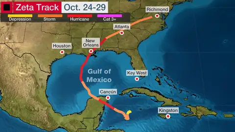

Image Source: https://weather.com/storms/hurricane/news/2020-10-29-hurricane-zeta-tropical-storm-forecast-south-east

## Storm Surge

Storm surge is defined as the abnormal rise of water generated by a storm, above the predicted astronomical tide, and is expressed in terms of height above normal tide levels. Hurricane Zeta produced storm surge inundation of 6-10 feet above ground level (AGL) along the Mississippi Coast and along the Alabama coast west of Mobile Bay. The highest observation in Louisiana was recorded to be 7.0 ft, north of Grand Isle, but the storm surge hindcast suggests that this was a result of Zeta’s winds piling water up against the west side. The severe “storm surge flooding caused hundreds of roads to become impassable in the Bay St. Louis area, and portions of the U.S. Highway 90 were underwater in Harrison County. According to the NOAA report, “generally minor damage was reported in other areas of southern Mississippi.”

## Rainfall & Flooding

Hurricane Zeta resulted in flooded streets in the Mexican state of Quintana Roo, but there was no significant damage from the flooding. In the United States, 4-6 inches of rain was observed near Zeta’s landfall location in southeastern Louisiana through southeastern Mississippi and western Alabama. However, something to note is that the fast speed of Zeta limited the rainfall and flooding impacts in the areas that it hit. According to NOAA, “an enormous amount of rainfall reports were received from Zeta in both its tropical and extratropical stages.” Furthermore “the precursor disturbance of Zeta led to heavy rain and flooding in Jamaica, although no rainfall totals are available.”

From the NOAA Hurricane Report:

> Freshwater flooding across southern Alabama and the western Florida Panhandle was exacerbated by storm surge, which prevented rainwater from draining into adjacent tidal rivers, bays, or the Gulf of Mexico. Major-to-moderate flooding occurred along many rivers, with several river gauges measuring their highest level on record.

## Topography & Bathymetry Data

Topography data can be obtained from https://download.gebco.net/. 

The topography file used for this example covers the area between 42 degrees to the north, 12 degrees to the south, -100 degrees to the west and -70 degrees to the east. An ASCII, Grid/TID Grid file was used. (15 arc-second interval grid).

The topography file was placed in the ‘scratch’ directory. 

```
# Scratch directory for storing topo and storm files:
scratch_dir = os.path.join(os.environ["CLAW"], 'geoclaw', 'scratch')
```
“CLAW” refers to an environment variable that provides the entire path to clawpack (more information can be found at: https://www.clawpack.org/setenv.html)


## Storm Data

Hurricane Zeta storm data was obtained from NOAA’s storm data archive: https://ftp.nhc.noaa.gov/atcf/archive/2020/bal282020.dat.gz 

Data is fetched by modifying the following code in setrun.py: 

```
# Convert ATCF data to GeoClaw format
clawutil.data.get_remote_file("https://ftp.nhc.noaa.gov/atcf/archive/2020/bal282020.dat.gz ")
atcf_path = os.path.join(scratch_dir, "bal282020.dat")
```
This automatically places the storm data in the same scratch directory defined for the topography data.


## GeoClaw Parameters

Parameters for the Hurricane Zeta simulation were set in setrun.py.

### Landfall & Time Range

The time of the landfall was set to be 28 October, 2200 UTC. The time range of the simulation was set to be -0.75 days before landfall and 1.5 days after landfall. 

Date and time of landfall is set in the following code segment in setrun.py:
```
# Time of Landfall
zeta.time_offset = datetime.datetime(2020, 10, 28, 22)

```

The start time for the simulation is set in the following code segment in setrun.py:
```
# -------------
# Initial time:
# -------------
clawdata.t0 = days2seconds(-0.75)
```

The final time for the simulation is set in the following code segment in setrun.py:
```
if clawdata.output_style == 1:
   # Output nout frames at equally spaced times up to tfinal:
   clawdata.tfinal = days2seconds(1.5)
   recurrence = 24
```

### Gauges

Eleven gauges were selected near the coasts of Louisiana, Alabama and Mississippi using the NOAA Inundations dashboard: https://tidesandcurrents.noaa.gov/map/index.html.


Both setrun.py and setplot.py read in gauges from a file called “gauges_final.csv” placed in the scratch directory. The columns prefaced with “Original” refer to the coordinates of the tide gauges written on the NOAA website. The columns “Latitude Decimal” and “Longitude Decimal” have been modified from the original locations slightly because the original locations were often too close to the coast to be recognized as being in the water at low refinement levels. The only columns necessary to run the code are Number, Latitude Decimal, and Longitude Decimal, located in their respective columns. 

Gauge Number | Full Name | ID | Location | Original Latitude (Degrees) | Original Latitude (Minutes) | Latitude (Decimal) | Original Longitude (Degrees) | Original Longitude (Minutes) | Longitude (Decimal)
--- | --- | --- | --- | --- | --- | --- | --- | --- | --- |
1 | 8747437 Bay Waveland Yacht Club, MS | 8747437 | Bay Waveland Yacht Club, MS | 30 | 19.6 | 30.21422 | 89 | 19.5 | -89.3036
2 | 8741533 Pascagoula NOAA Lab, MS | 8741533 | Pascagoula NOAA Lab, MS | 30 | 22.1 | 30.32783 | 88 | 33.8 | -88.5542
3 | 8739803 Bayou La Batre Bridge, AL | 8739803 | Bayou La Batre Bridge, AL | 30 | 24.4 | 30.31587 | 88 | 14.9 | -88.3234
4 | 8736897 Coast Guard Sector Mobile, AL | 8736897 | Coast Guard Sector Mobile, AL | 30 | 39 | 30.61106 | 88 | 3.5 | -88.9865
5 | 8761305 Shell Beach, LA | 8761305 | Shell Beach, LA | 29 | 52.1 | 29.91724 | 89 | 40.4 | -89.6603
6 | 8761724 Grand Isle, LA | 8761724 | Grand Isle, LA | 29 | 15.8 | 29.26012 | 89 | 57.4 | -89.9152
7 | 8760922 Pilots Station East, S.W. Pass, LA | 8760922 | Pilots Station East, S.W. Pass, LA | 28 | 55.9 | 28.95706 | 89 | 24.4 | -89.5261
8 | 8732828 Weeks Bay, Mobile Bay | 8732828 | Weeks Bay, Mobile Bay | 30 | 25 | 30.33612 | 87 | 49.5 | -87.956
9 | 8761927 New Canal Station, LA | 8761927 | New Canal Station, LA | 30 | 1.6 | 30.1325 | 90 | 6.8 | -90.0828
10 | 8737048 Mobile State Docks, AL | 8737048 | Mobile State Docks, AL | 30 | 42.3 | 30.65084 | 88 | 2.4 | -88.0242
11 | 8735391 Dog River Bridge, AL | 8735391 | Dog River Bridge, AL | 30 | 33.9 | 30.56692 | 88 | 5.3 | -88.0061


### AMRClaw

AMR (adaptive mesh refinement) was used to refine areas for analysis. Using this algorithm allows us to gain a higher resolution of regions to solve bad simulation curves by GeoClaw. 

The following code in setrun.py can be used to include or exclude the AMRClaw algorithm:

```
from clawpack.clawutil import data
assert claw_pkg.lower() == 'geoclaw',  "Expected claw_pkg = 'geoclaw'"
num_dim = 2
rundata = data.ClawRunData(claw_pkg, num_dim)
```

AMR parameters can also be set/modified in setrun.py.

The maximum number of refinement levels was set to 4:

```
# Max number of refinement levels:
amrdata.amr_levels_max = 4
```

Refinement ratios were chosen as:
```
# List of refinement ratios at each level (length at least mxnest-1)
amrdata.refinement_ratios_x = [2, 2, 2, 6, 16]
amrdata.refinement_ratios_y = [2, 2, 2, 6, 16]
amrdata.refinement_ratios_t = [2, 2, 2, 6, 16]
```

Refinement Regions: In order to maximize computing power and ensure refinement in relevant areas, regions were defined with a maximum and minimum refinement level. The minimum refinement evel around the storm’s landfall was set as 4 and the maximum was also set as 4. In setrun.py:
```
# == setregions.data values ==
regions = rundata.regiondata.regions  


# to specify regions of refinement append lines of the form
#  [minlevel,maxlevel,t1,t2,x1,x2,y1,y2]
regions.append([4, 4, clawdata.t0, clawdata.tfinal, -94, -85, 28, 32])
```

Caution: higher refinement levels may increase the run time exponentially without making much progress. If you are running the program on a more powerful machine, a higher refinement level can be used. 

More information can be found at: https://www.clawpack.org/setrun_amrclaw.html#setrun-amrclaw. 

## Observed Surge Data

To compare the simulation surge data by GeoClaw to the actual data, we collected the observed surge data with the following code segment: clawpack.geoclaw.util.fetch_noaa_tide_data. To get the storm surge, we eliminated the initial differences between the data from the simulation and the observed data. 

The storm surge data was plotted by subtracting the predicted tide level from the observed sea level at each point in time. In addition, there was a significant initial difference between observed and simulated sea level for each gauge, which was eliminated in plotting the curves.

## Validation Result

### Map

A map of gauges located on the simulation just as the storm reaches landfall:

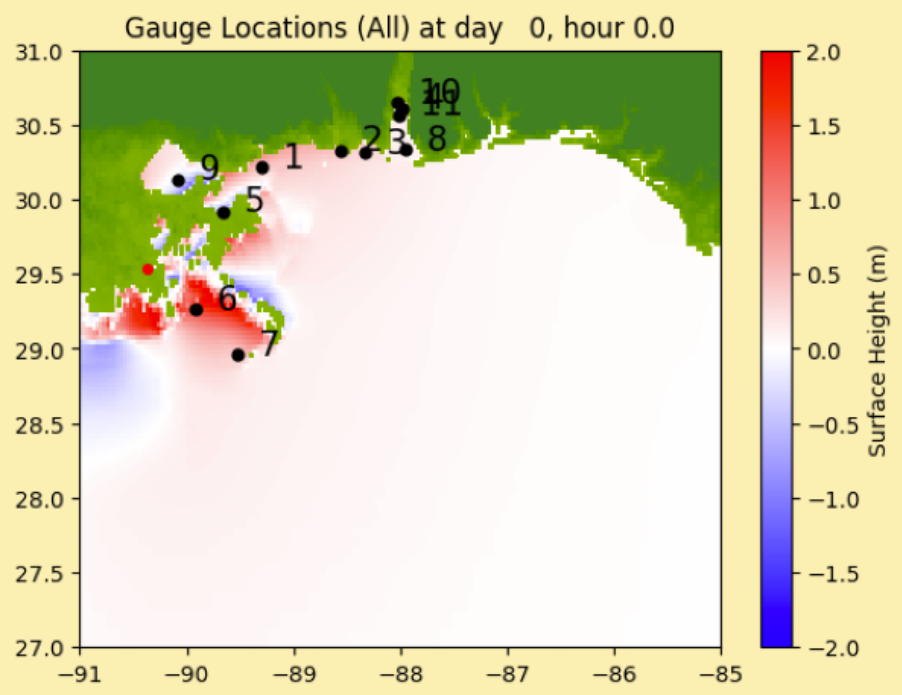

### Station 1 - Bay Waveland Yacht Club, MS

Bay Waveland Yacht Club, MS (ID: 8748437) experienced a storm surge of approximately 2.40 meters. GeoClaw predicted approximately 1.10 meters. 

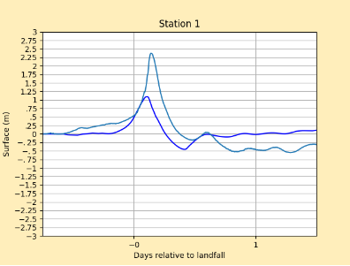

### Station 2 – Pascagoula NOAA Lab, MS

Pascagoula NOAA Lab, MS (ID: 8741533) experienced a storm surge of approximately 2.00 meters. GeoClaw predicted approximately 1.25 meters.

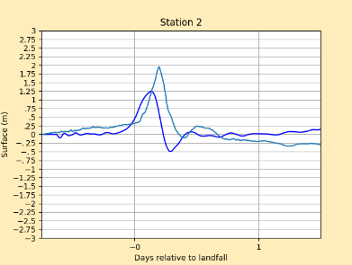

### Station 3 – Bayou La Batre Bridge, AL

Bayou La Batre Bridge, AL (ID: 8739803) experienced a storm surge of approximately 1.95 meters. GeoClaw predicted approximately 0.85 meters. 

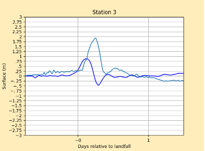

### Station 4 – Coast Guard Sector Mobile, AL

Coast Guard Sector Mobile, AL (ID: 8736897) experienced a storm surge of approximately 1.50 meters. GeoClaw predicted 1.25 approximately meters. 

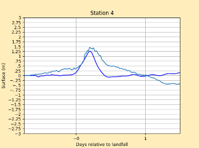

### Station 5 – Shell Beach, LA

Shell Beach, LA (ID: 8761305) experienced a storm surge of approximately -1.60 meters. GeoClaw predicted approximately -1.95 meters. 

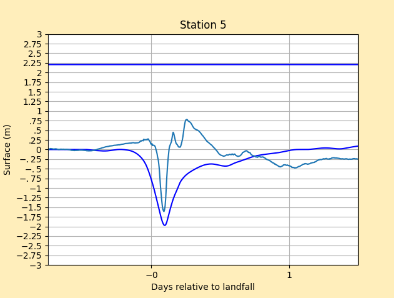

### Station 6 – Grand Isle, LA

Grand Isle, LA (ID: 8761724) experienced a storm surge of approximately 0.80 meters. GeoClaw predicted approximately 1.70 meters. 

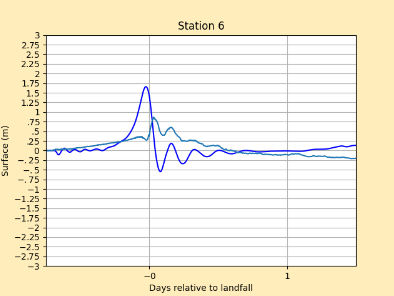

### Station 7 – Pilots Station East, S.W. Pass, LA

Pilots Station East, S.W. Pass, LA (ID: 8760922) experienced a storm surge of approximately 0.50 meters. GeoClaw predicted approximately 0.50 meters. 

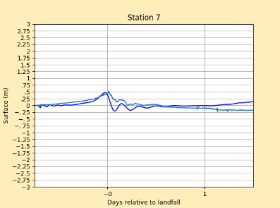

### Station 8 – Weeks Bay, Mobile Bay

Weeks Bay, Mobile Bay (ID: 8732828) experienced a storm surge of approximately 1.15 meters. GeoClaw predicted approximately 0.50 meters. 

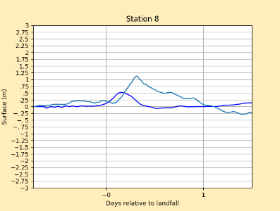

### Station 9 – New Canal Station, LA

New Canal Station, LA (ID: 8761927) experienced a storm surge of approximately 1.10 meters. GeoClaw predicted approximately 0.30 meters. 

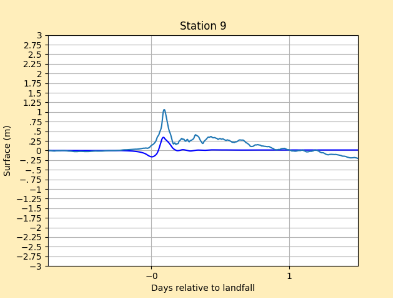

### Station 10 – Mobile State Docks, AL 

Mobile State Docks, AL (ID: 8737048) experienced a storm surge of approximately 1.40 meters. GeoClaw predicted approximately 1.25 meters. 

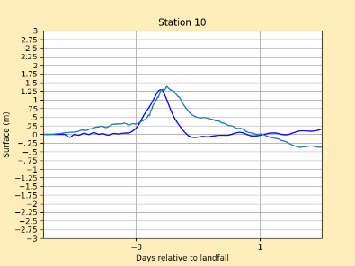

### Station 11 – Dog River Bridge, AL

Dog River Bridge, AL (ID: 8735391) experienced a storm surge of approximately 1.15 meters. GeoClaw predicted 1.10 meters. 

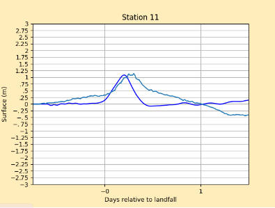

### Result Interpretation

Storm surge typically occurs when hurricane winds blow onshore, and reverse storm surge occurs when winds blow away from the shore, pushing water away from the coast. As hurricanes spin counterclockwise, areas that are located west of the center of the storm tend to exhibit reverse storm surge. This can be seen in the plot for Station 5, which is Shell Beach, LA, which although is not located west of the center of the storm, is situated on a peninsula and so the water is pushed away from the land. The remaining stations exhibit positive storm surge as the hurricane reaches landfall. Station 9 is located to the west of the center of the storm but does not seem to show reverse storm surge, and this is because the gauge is located in Lake Pontchartrain, and so when the center of the storm passes by the gauge, the water is pushed towards the coast south of the lake. Stations 1 and 2 have the highest recorded levels of positive storm surge at around 2.00 meters. 

### Comparison of Simulation to Gauge Station Data

For most of the gauges, the storm surge predicted by GeoClaw was slightly under the actual storm surge. In station 5, where the gauge recorded reverse storm surge, GeoClaw predicted a greater reverse storm surge (in terms of magnitude). For station 6, GeoClaw predicted a significantly higher storm surge for the maximum value, but then dipped under the actual storm surge. 

Differences in simulated and real storm surge can be due to a variety of factors depending on the storm and the geography around each gauge. For example, there was significant rainfall in Hurricane Sally, which GeoClaw does not account for; therefore, higher storm surge at certain gauges that was impacted by rainfall may not be accurately represented by the simulations, therefore making simulated storm surges lower. Stations 3, 8, 10, and 11 are all located in Mobile Bay. Bays can essentially trap storm surge or create a tidal resonance effect, and the small barrier islands around Mobile Bay may also increase the inaccuracy of the simulations as they only appear at high refinements. Stations 10 and 11 exhibit a similar pattern in which Geoclaw underestimates the initial surge but is unable to produce the reverse storm surge that happens 1 day after landfall. Station 5 appears to have an additional “prediction” line between the 2.5 and 2.75 meter mark. This could occur as a result of the gauge being on land for even part of the storm as station 5 is located very close to land. The location of this gauge cannot be adjusted too much as it is located in a body of water that is surrounded by land. Stations 1-3 exhibit the highest levels of storm surge. 

In addition, computational sources of differences in simulated and real data arise from refinement and gauge locations. As a result of tide gauges typically being located very close to the shore and the simulation not being refined enough to recognize their location in the water, many of the gauge locations had to be slightly modified from their exact real locations to let the simulation data be generated. More powerful machines that are able to refine to higher levels while using more precise gauge locations may result in a more accurate simulation.

## Conclusion

A visible analysis of the data indicates that GeoClaw was generally accurate in predicting locations that had storm surge, reverse storm surge (when applicable), and the times of this occurring. Some differences in results may be attributed to insufficient refinement along with using modified gauge locations, which could be improved through additional simulations. Running the simulation on a more powerful device that can handle higher maximum refinement levels may also improve the predictions. Other sources of discrepancies lie in geophysical phenomena that are not accurately portrayed through the mathematical models that GeoClaw uses.


